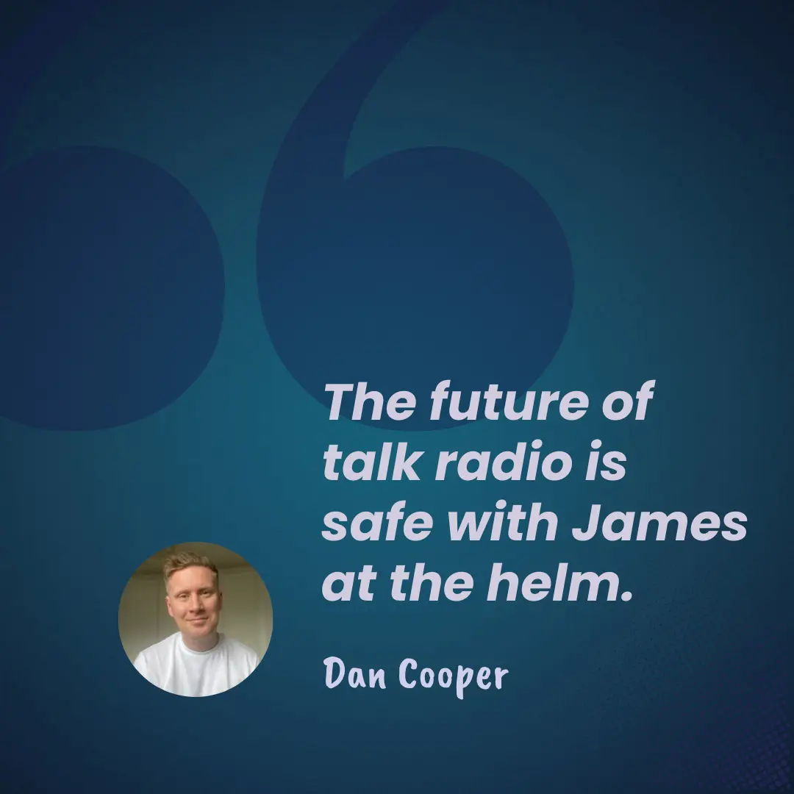

---
aliases:
    - "radio"
    - "radio-show-archive"
date: 2025-01-01
description: "Tune in to the Swing with Jim show every Thursday from 19:00 BST. Featuring two hours of big band hits, and interviews with interesting individuals."
image: "/images/dj.webp"
slug: "swingwithjim"
title: "Swing with Jim - The Best of Big Band"
type: "page"
---



Missed the show? Hear it again every Sunday from 15:00.

## Home of Jibber Jabber with Jim {#jibber-jabber-with-jim}



[New episodes](/jibberjabberwithjim/) air every Thursday at 20:00 BST.
